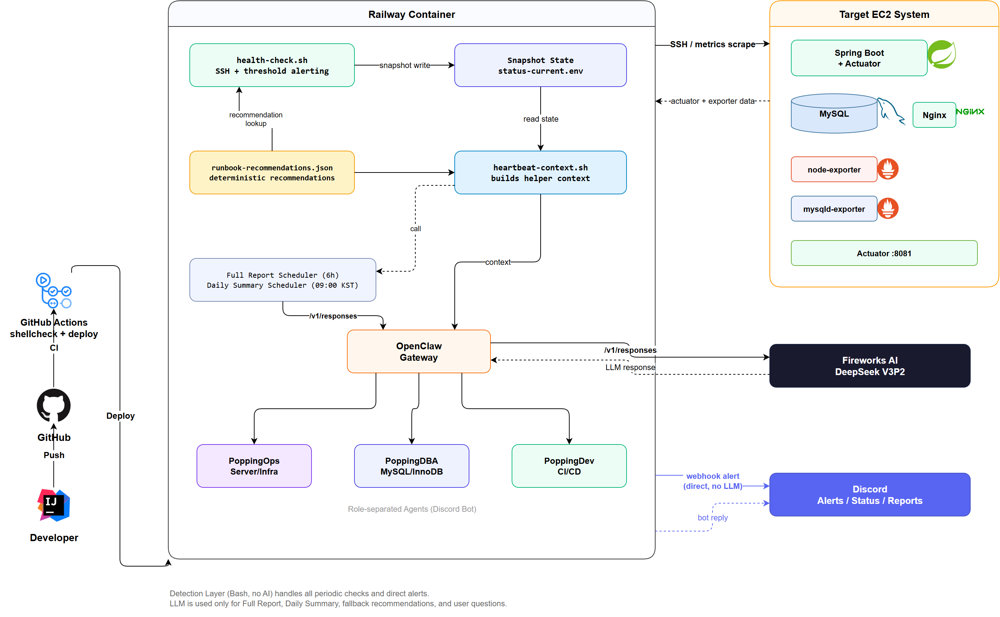
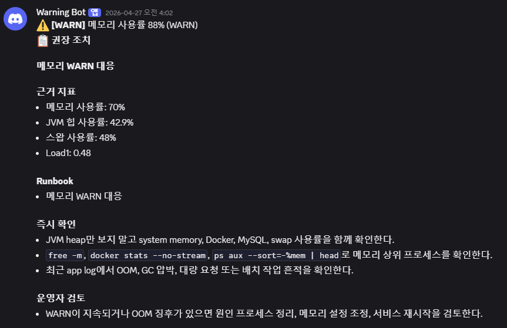
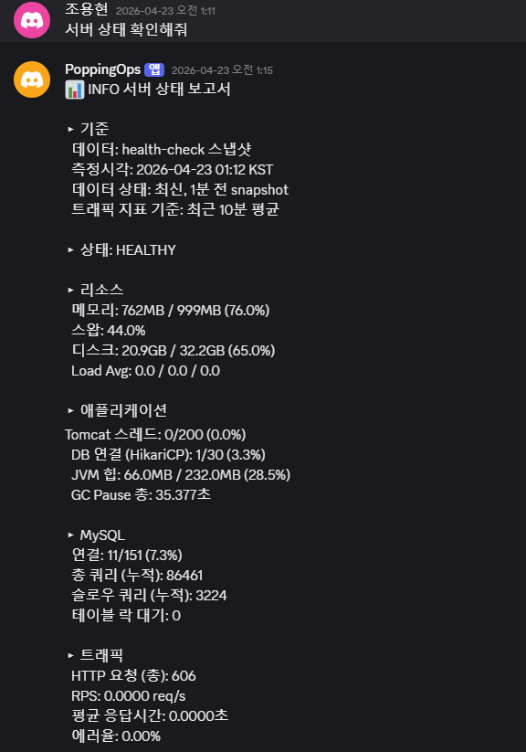
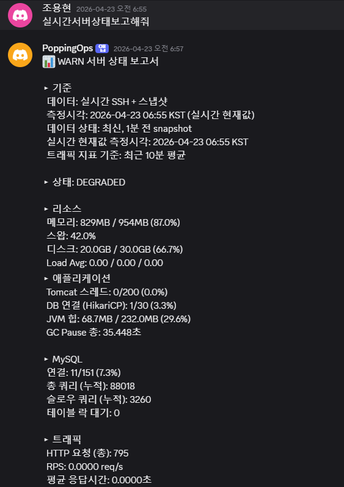

# PoppingOps

EC2에서 운영 중인 Spring Boot/MySQL 서비스를 외부에서 감시하고, Discord로 상태 조회와 장애 알림을 제공하는 운영 자동화 시스템입니다.

## 핵심 결과

- 로컬 PC 의존 모니터링을 Railway 상시 실행 구조로 바꿔 서버 이상을 `최대 10분 이내` 인지할 수 있게 했습니다.
- 정기 감지와 1차 알림을 Bash 기반으로 분리해 정상 반복 체크의 AI 비용을 `0원`으로 유지했습니다.
- `서버 장애`와 `모니터링 장애`를 구분해 stale snapshot을 정상으로 오인하는 문제를 막았습니다.
- Full Report와 Daily Summary를 helper-first context 기반으로 구성해 LLM은 해석이 필요한 구간에서만 사용하도록 제한했습니다.

## 프로젝트 소개

작은 서버를 운영할 때 가장 위험한 문제는 "장애를 늦게 아는 것"과 "잘못된 상태를 정상이라고 믿는 것"입니다.  
PoppingOps는 이 문제를 해결하기 위해 만든 운영 보조 시스템입니다.

이 프로젝트는 다음 요구를 만족하도록 설계했습니다.

- 로컬 PC를 꺼도 모니터링이 멈추지 않을 것
- 정상 반복 체크에 LLM 호출이 섞이지 않을 것
- 오래된 snapshot과 현재 상태를 구분해서 보여줄 것
- 모니터링 시스템 자체의 실패도 별도로 감지할 것
- 알림 후 운영자가 바로 확인할 수 있는 조치 가이드를 함께 제공할 것

## 기술 스택

- `Bash`
- `Railway`
- `Docker`
- `GitHub Actions`
- `Discord Bot / Webhook`
- `OpenClaw Gateway`
- `Spring Boot Actuator`
- `node-exporter`
- `mysqld-exporter`

## 아키텍처

## 핵심 설계 선택

### 1. 감지와 분석을 분리

초기에는 heartbeat 기반으로 LLM이 상태를 직접 판단하는 구조를 고려했지만, 정상 상태에서도 반복 호출 비용이 계속 발생하고 AI 장애가 곧 모니터링 장애로 이어질 수 있었습니다.

그래서 구조를 다음처럼 분리했습니다.

- 감지: `health-check.sh`가 SSH로 메트릭 수집, 임계값 판정, 상태 전이 감지
- 상태 저장: 최신 snapshot을 파일로 저장
- 분석: helper가 만든 context를 바탕으로 LLM이 Full Report, Daily Summary, 질의응답 수행

이 구조 덕분에 정상 반복 체크는 LLM 호출 없이 계속 돌고, 운영 비용과 장애 전파 범위를 동시에 줄일 수 있었습니다.

### 2. snapshot freshness와 self-monitoring 추가

snapshot 기반 보고는 빠르지만, 수집이 멈춘 뒤 오래된 데이터를 최신 상태로 오인할 위험이 있습니다.  
이를 막기 위해 snapshot 측정 시각과 freshness를 함께 기록하고, 임계 시간을 넘기면 WARN/CRITICAL로 격상합니다.

또한 다음 실패를 별도로 추적합니다.

- SSH 실패
- 메트릭 파싱 실패
- 필수 메트릭 누락
- snapshot 쓰기 실패

같은 유형이 연속으로 발생하면 "서버 장애"가 아니라 "모니터링 장애"로 따로 알립니다.

### 3. runbook-first 권장 조치

장애 알림은 단순히 "이상 있음"에서 끝나면 효용이 낮습니다.  
PoppingOps는 `docs/runbook.md`와 `config/runbook-recommendations.json`을 기준으로 심각도별 권장 조치를 먼저 제시하고, 직접 매핑되지 않는 경우에만 LLM fallback을 사용합니다.

즉, 이 시스템의 역할은 임의로 시스템을 수정하는 자동 복구가 아니라:

- 현재 상태를 빠르게 알려주고
- 검증된 조치 순서를 먼저 제시하고
- 추가 해석이 필요한 경우에만 AI를 붙이는 것

입니다.

### 4. 역할별 에이전트 분리

한 에이전트가 서버, DB, CI/CD를 모두 담당하면 context가 커지고 판단이 흐려집니다.  
그래서 역할을 다음처럼 나눴습니다.

- `PoppingOps`: 서버/인프라 모니터링
- `PoppingDBA`: MySQL/InnoDB 분석
- `PoppingDev`: GitHub Actions, 배포 상태 분석

이 분리는 LLM 자체보다 운영 도메인 경계를 어떻게 나누는지가 중요하다는 판단에서 나왔습니다.

## 실제 스크린샷

### 장애 경고

메모리 WARN 발생 시 Discord로 알림과 권장 조치를 함께 전송합니다.

### 서버 상태 조회

사용자가 봇에게 현재 서버 상태를 요청하면 최신 snapshot 기준으로 상태를 요약해 보여줍니다.

### 실시간 상태 조회

필요할 때는 snapshot만 읽는 대신 즉시 SSH 수집 기반 상태 확인도 수행할 수 있습니다.

## 주요 기능

- `10분` 주기 health/resource check
- WARN / CRITICAL / 복구 상태 전이 알림
- snapshot 기반 서버 상태 요약
- 실시간 서버 상태 확인
- Full Report / Daily Summary
- DB 분석, CI/CD 분석 역할 분리
- runbook 기반 권장 조치 제안

## 문서

- [Architecture](docs/architecture.md)
- [Runbook](docs/runbook.md)
- [Target System](docs/target-system.md)
- [Prompt Engineering History](docs/prompt-engineering-history.md)

## 배포와 검증

- GitHub Actions에서 셸 스크립트 문법 검증 후 배포합니다.
- Railway는 GitHub 저장소와 연결되어 CI를 통과한 `main` 커밋만 반영합니다.
- 컨테이너 시작 시 필수 환경 변수를 먼저 검증해 불완전한 상태로 떠 있지 않도록 했습니다.
